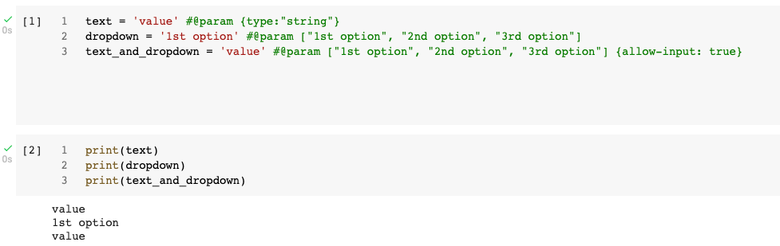
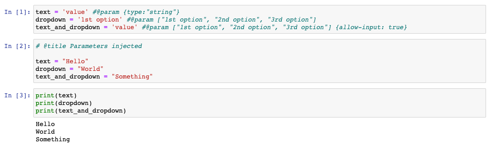

colabmill
=======================================================================================================================

**colabmill** is a tool for parameterizing, executing, and analyzing
Colab-flavored Jupyter Notebooks.

Colabmill lets you do what Papermill does, but optimized for Colab-flavored Jupyter Notebooks:

-   **parameterize** notebooks, following Colab form syntax
-   **execute** notebooks online/offline

## Installation

From the command line:

``` {.sourceCode .bash}
pip install git+https://github.com/CourierKyn/colabmill
```

For all optional io dependencies, you can specify individual bundles
like `s3`, or `azure` -- or use `all`

``` {.sourceCode .bash}
pip install git+https://github.com/CourierKyn/colabmill#egg=colabmill[all]
```

## Python Version Support

This library currently supports Python 3.6+ versions. As minor Python
versions are officially sunset by the Python org colabmill will similarly
drop support in the future.

## Usage

### Parameterizing a Notebook

To parameterize your notebook designate a cell with the comment ``#@param [...]``.



Codemill looks for the ``#@param`` cell and treats this cell as defaults for the parameters passed in at execution 
time. Colabmill will add a new cell tagged with ``#@title Parameters injected`` with input parameters in order to 
overwrite the values with ``#@param``. If no cell contains ``#@param`` the injected cell will be inserted at the top of 
the notebook.

Additionally, if you rerun notebooks through colabmill and it will reuse the ``#@title Parameters injected`` cell from 
the prior run. In this case Colabmill will replace the old ``#@title Parameters injected`` cell with the new run's 
inputs.



### Executing a Notebook

The two ways to execute the notebook with parameters are: (1) through
the Python API and (2) through the command line interface.

See [Papermill](https://github.com/nteract/papermill).

Development Guide
-----------------

Read [CONTRIBUTING.md](./CONTRIBUTING.md) for guidelines on how to setup a local development environment and make code 
changes back to Colabmill.

For development guidelines look in the [DEVELOPMENT_GUIDE.md](./DEVELOPMENT_GUIDE.md) file. This should inform you on 
how to make particular additions to the code base.

Documentation
-------------

See the [Papermill documentation](http://papermill.readthedocs.io)
on ReadTheDocs.
